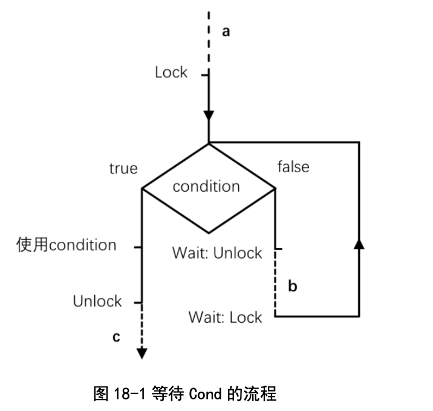

# sync.Cond详解

在Go语言众多的同步原语中，`sync.Cond` 是一个相对较少被提及的工具。因为它比较特殊，理解起来有点难度，但同时它也非常强大，能够帮助我们解决一些复杂的同步问题。

## sync.Cond是什么

`sync.Cond` 结构体包含一个`Locker` 类型的字段 `L` 和三个方法：`Wait()`、`Signal()` 和 `Broadcast()`。这四个东西单独看起来都非常简单，但是当它们被组合为一个 `sync.Cond` 的时候，就不那么简单了。

`sync.Cond` 是一个并发安全的条件变量。它的 `Wait()` 方法可以用来等待某个条件的发生，并且在条件满足时被唤醒。谁来唤醒它呢？就是 `Signal()` 和 `Broadcast()` 方法。`Signal()` 用来唤醒一个等待的 goroutine，而 `Broadcast()` 则用来唤醒所有等待的 goroutine。

在改变和观测条件时，必须持有 `Cond.L`，所以在调用 `Wait()` 方法之前必须先调用 `L.Lock()`。`Wait()` 方法的工作模式比较特殊，它会在一个不可打断的原子操作中解锁`L`，并阻塞当前 goroutine，直到被 `Signal()` 或 `Broadcast()` 唤醒后再次锁定 `L`然后返回。

### Cond.Wait

由于在 `Wait()` 阻塞期间当前 goroutine 并不持有 `L`，并且“Wait被唤醒”只意味着“条件被改变”而不是“条件已满足”，因此在 `Wait()` 返回后，必须再次检查条件是否满足。于是，正确使用 `Wait()` 的模式是：

```go
var c sync.Cond = ...

c.L.Lock()

for !condition() {
    c.Wait() 
}
// 使用 condition ...

c.L.Unlock()
```

在我的新书[《深入理解Go语言：规范、原理与实践》](https://github.com/mkch/go-in-depth-book-code)中，我使用了下面这个流程图来总结 `Wait()` 的使用模式：

 

 先Lock，然后判断condition，如果为true就使用condition，即执行条件满足时应该执行的操作。如果为false，就调用 `Wait()` 方法， `Wait()` 方法内部会原子地执行UnLock并阻塞当前 goroutine 以等待唤醒。当Wait被唤醒后它会重新Lock并返回，再次判断condition。如此反复，直到condition为true。

图中实线部分代表调用者持有L，虚线部分代表未持有L。调用者在时段b中未持有`L`是因为 `Wait()` 方法会解锁`L`然后阻塞。

### Cond.Signal 和 Cond.Broadcast

`Cond` 的 `Signal()` 和 `Broadcast()` 方法就相对简单一些：

```go
c.L.Lock()

ChangeCondition()
c.Signal() // 或者 c.Broadcast()

c.L.Unlock()
```

其中 `ChangeCondition()` 用于改变条件的状态，这里假设它会让条件变为满足状态。`Signal()` 或 `Broadcast()` 用于唤醒其他 goroutine 中的 `Wait()`。其中 `Signal()` 或 `Broadcast()` 的调用可以持有 `L`也可以不持有 `L`。

我们以通知时持有 `L` 的方式来分析 `Signal()` 和 `Broadcast()` 的行为：

由于这段代码需要持有 `L`，所以它只可能发生在上图中的时间段a、b或c中。

如果发生在时间段c，则这次条件改变必定不会被这次等待所观测到，不在讨论之列。当然可能被下次等待观测到。

如果发生在时间段a，则等待方必然观测到此次改变，走左边分支。

如果发生在时间段b，`Signal()`会通知正在阻塞的 `Wait()`，使其解除阻塞，重新Lock `L`，继续循环，观测到条件改变，走左边分支。

如果通知时不持有`L`，则整个流程会有一点点不同。如果你对通知时不持有`L`的具体执行流程感兴趣可以参考我书里的内容。

这就是所谓的 `sync.Cond` 即“基于条件的等待和通知”。

## sync.Cond的应用

那么 `sync.Cond` 的应用场景是什么呢？直白地说，它可以用于任何“基于条件的等待和通知”的场景。比如说，在我的书里有这么一个例子：用 Cond 模拟 chan。

```go
type Channel[T any] struct {
    cond sync.Cond // 条件变量
    buf  []T       // 缓冲区
    cap  int       // 容量
}
```

一个 Channel 结构体包含一个 Cond，一个缓冲区和一个容量。我们可以通过 Cond 来实现 Channel 的发送和接收操作：

其中发送操作的核心代码为：

```go
// send 向 c 中写入 v. 调用时必须持有 c.cond.L.
func (c *Channel[T]) send(v T) {
    // 等待 buf 有剩余空间
    for !(len(c.buf) < c.cap) {
        c.cond.Wait()
    }
    // 写出 v
    c.buf = append(c.buf, v)
    // 通知
    c.cond.Broadcast()
}
```

它等待的条件为 `len(c.buf) < c.cap`，也就是缓冲区有剩余空间。当条件不满足时，它就调用 `Wait()` 来等待。当条件满足时，它就向缓冲区写入数据，并调用 `Broadcast()` 来通知其他等待的 goroutine。

接收操作的核心代码为：

```go
// recv 从 c 中读取一个值. 调用时必须持有 c.cond.L.
func (c *Channel[T]) recv() (v T) {
    // 缓冲区有数据可读
    for !(len(c.buf) > 0) {
        c.cond.Wait()
    }
    // 读取
    v = c.buf[0]
    c.buf = c.buf[1:]
    // 通知
    c.cond.Broadcast()
    return
}
```

它等待的条件为 `len(c.buf) > 0`，也就是缓冲区有数据可读。当条件不满足时，它就调用 `Wait()` 来等待。当条件满足时，它就从缓冲区读取数据，并调用 `Broadcast()` 来通知其他等待的 goroutine。

虽然这个 Channel 的实现非常简陋，但通过它我们一下子就掌握了 Go channel 的核心工作原理。

另外，我的另一个项目中我使用 `sync.Cond` 实现了一系列基于条件的等待和通知的工具，比如说 `MutexGroup`，一个可以取消并且可以原子地一次性持有多个Mutex的工具。这个工具的一个典型应用就是解决经典的哲学家就餐问题。

从这个演示可以看出，如果使用Mutex来解决哲学家就餐问题，很容易导致死锁，因为每个哲学家都可能同时持有一只筷子，然后等待另一只筷子被释放。但是如果使用 `MutexGroup`，每个哲学家就可以一次性持有两只筷子，这样就不会发生死锁了。

总之，`sync.Cond` 是一个比较难以理解但非常强大的同步原语。就像武侠片里面的独门绝技，虽然不常用，但关键时刻能救人一命。

最后，按照惯例，宣传一下我的新书[《深入理解Go语言：规范、原理与实践》](https://github.com/mkch/go-in-depth-book-code)。这本书由清华大学出版社出版。需要的朋友可以去各大书店搜索购买。

感谢您的观看。
