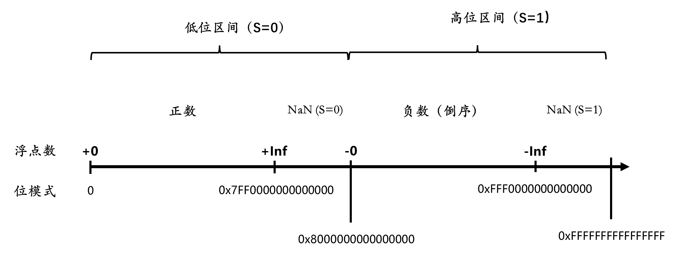
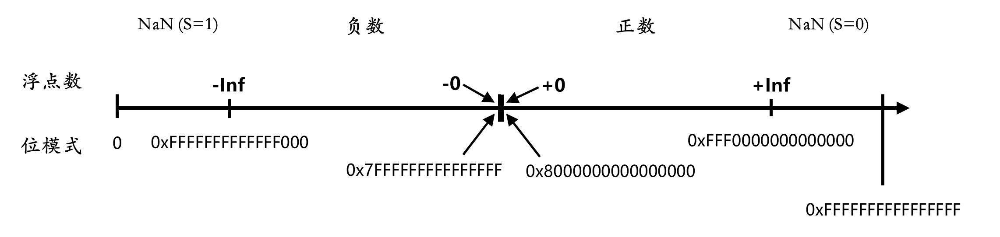
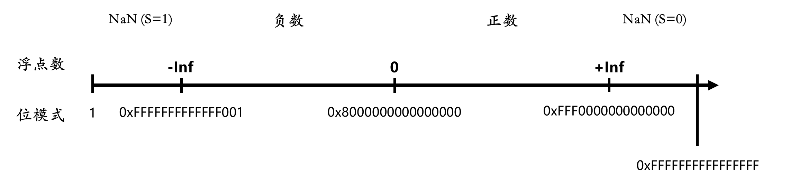

# 浮点数ULP距离

实数是连续的，IEEE 754 浮点数是离散的。

相邻两个浮点数之间的差值叫做一个ULP（Unit in the Last Place）。

`ULP距离`是指两个浮点数之间的ULP数量。

## 朴素的计算方法

```go
func ulpDistance(a, b float64) (n int) {
    if a > b {
        a, b = b, a
    }

    for i := a; i != b; i = math.Nextafter(i, b) {
        n++
    }
    return
}
```

> [!CAUTION]
>
> 效率非常低！尤其当a和b相差较大时。

## AI给出的算法

```go
func ulpDistance(f1, f2 float64) uint64 {
    var orderedBits = func(f float64) uint64 {
        u := math.Float64bits(f)
        if u&(1<<63) != 0 {
            return ^u + 1
        }
        return u | (1 << 63)
    }

    if math.IsNaN(f1) || math.IsNaN(f2) || math.IsInf(f1, 0) || math.IsInf(f2, 0) {
        panic("can't calculate ULP distance for NaN or Inf")
    }

    a := orderedBits(f1)
    b := orderedBits(f2)
    if a >= b {
        return a - b
    }
    return b - a
}
```

### IEEE 754（float64）

| 组成部分 | 位宽（Bits） | 范围 | 功能 |
| --- | --- | --- | --- |
| 符号位 （Sign） | 1 bit | 第 63 位 | 决定正负（0 为正，1 为负） |
| 阶码 （Exponent） | 11 bits | 第 62\~52 位 | 决定数值的范围（指数部分） |
| 尾数 （Fraction/Mantissa） | 52 bits | 第 51\~0 位 | 决定数值的精度（有效数字） |

- 正规数

$(-1)^S × (1 + M×2^{-52}) × 2^{E-1023}$

- 次正规数

$(-1)^S × (M×2^{-52}) × 2^{-1022}$

- 特殊值

| 值 | S | E | M |
| --- | --- | --- | --- |
| 正零 | 0 | 0 | 0 |
| 负零 | 1 | 0 | 0 |
| 正无穷 | 0 | 0x7FF | 0 |
| 负无穷 | 1 | 0x7FF | 0 |
| NaN | 0 或 1 | 0x7FF | 非全零 |

例如，`-26.375`

$1.1010011_2 × 2^4$

| S | E | M |
| --- | --- | --- |
| 1 | 10000000011 | 1010011000000000000000000000000000000000000000000000 |
| - | 1027（**4**+1023） | $1.1010011_2$ |

即`0xC03A600000000000`。

数轴



对负数执行 `^u`，对正数执行 `u | (1 << 63)`



> [!CAUTION]
>
> -0 和 +0 不重合！

对负数执行 `^u + 1`



## AI 给出的优化算法

```go
// ulpDistance calculates the ULP distance between two float64 values.
func ulpDistance(f1, f2 float64) uint64 {
    if math.IsNaN(f1) || math.IsNaN(f2) || math.IsInf(f1, 0) || math.IsInf(f2, 0) {
        panic("can't calculate ULP distance for NaN or Inf")
    }
    u1 := math.Float64bits(f1)
    u2 := math.Float64bits(f2)
    // Same sign, distance is the difference of the bit patterns.
    if int64(u1^u2) >= 0 {
        if u1 > u2 {
            return u1 - u2
        }
        return u2 - u1
    }
    // Different signs, distance is the sum of the distances to zero.
    // +0x8000000000000000 zeros out the sign bit.
    return u1 + u2 + 0x8000000000000000
}
```
